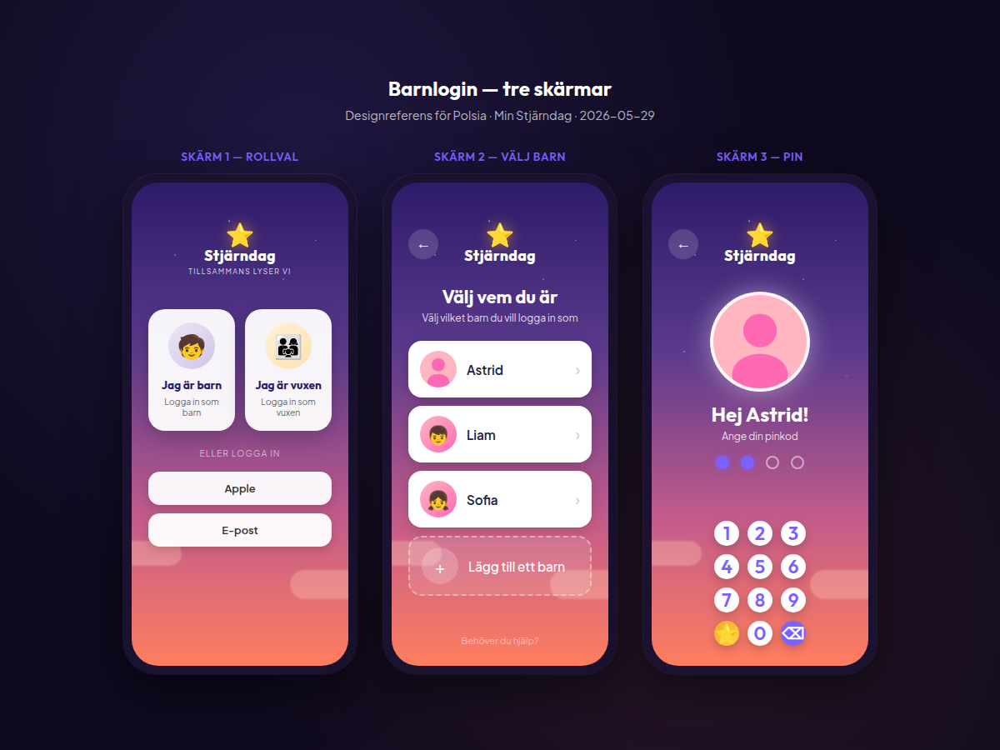

# Polsia — Barnlogin redesign ("Stjärnutforskare")

**Skapad:** 2026-05-29  
**Sida:** `/child-login` → `public/child-login.html`  
**API:** `POST /api/auth/child-login` (oförändrat — `{ username, pin }`)

Designreferens (i repot — Polsia läser från git):



- **Käll-HTML (redigerbar):** [`docs/mockups/barnlogin-mockup.html`](mockups/barnlogin-mockup.html)
- **GitHub:** `docs/mockups/barnlogin-3-skarmar.png`

| Skärm | Innehåll |
|-------|----------|
| **1 — Rollval** | "Jag är barn" / "Jag är vuxen" + Apple/e-post/Android |
| **2 — Välj barn** | Lista Astrid, Liam, Sofia + "Lägg till ett barn" |
| **3 — PIN** | "Hej Astrid!", avatar, prickar, siffertavla |

---

## 1. Mål

Ge barn och vuxna en **enhetlig "magisk natt"**-inloggning i **tre steg** (mockup):

**Skärm 1 — Rollval** (`login.html` eller `/` landing, se §3.1)  
**Skärm 2 — Välj barn** (`/child-login` steg 1)  
**Skärm 3 — PIN** (`/child-login` steg 2)

Gemensamt visuellt språk:

- Stjärnig natthimmel (lila → orange/rosa moln)
- Stjärndag-logo + *"TILLSAMMANS LYSER VI"*
- Stor rund **avatar** (selfie / foto / emoji)
- **Flera barn** — egen väljarskärm, inte fritext-gissning
- **Egen siffertavla** — runda knappar, lila siffror, stjärna + backspace
- Personlig hälsning: **"Hej Astrid!"**

**Behåll all befintlig auth-logik:** lockout, `POST /api/auth/child-login`, redirect till barn-dashboard, safe-area iOS.

---

## 2. Nuläge (idag)

| Aspekt | Idag |
|--------|------|
| Layout | Ljus bakgrund, navy text, emoji "Hej, Stjärnutforskare!" |
| Namn | Vanlig `<input type="text">` |
| PIN | `<input type="tel">` — systemtangentbord |
| Siffertavla | ❌ Finns inte |
| Flöde | ❌ En skärm, fritext namn |
| Barnväljare | ❌ |
| Selfie/foto | ❌ Bara emoji |
| JS | Inline i `child-login.html` (~200 rader) |
| CSS | Tailwind + inline `<style>` |

---

## 3. Tre-skärms-flöde (mockup)


```
Skärm 1 (login.html)          Skärm 2 (child-login)         Skärm 3 (child-login)
┌─────────────────────┐       ┌─────────────────────┐       ┌─────────────────────┐
│  ⭐ Stjärndag        │       │  ←  ⭐ Stjärndag     │       │  ←  ⭐ Stjärndag     │
│  TILLSAMMANS LYSER VI│       │                     │       │                     │
│ ┌────────┐┌────────┐ │       │  Välj vem du är     │       │    [Astrid foto]    │
│ │Jag är  ││Jag är  │ │  →    │  Välj barn...       │  →    │   Hej Astrid!       │
│ │ barn   ││ vuxen  │ │       │ ┌─────────────────┐ │       │   Ange din pinkod   │
│ └────────┘└────────┘ │       │ │ Astrid    [→]  │ │       │   ○ ○ ○ ○           │
│  ELLER LOGGA IN      │       │ │ Liam      [→]  │ │       │   [ 1 2 3 ]         │
│  [Apple][E-post]...  │       │ │ Sofia     [→]  │ │       │   [ 4 5 6 ] ...     │
└─────────────────────┘       │ │ + Lägg till barn│ │       └─────────────────────┘
                                │ └─────────────────┘ │
                                └─────────────────────┘
```

Navigering:

- **Skärm 1 → 2:** Tap **"Jag är barn"** → `window.location = '/child-login'`
- **Skärm 1 → vuxen:** Tap **"Jag är vuxen"** → visa e-post/Apple-form (befintlig login-magic)
- **Skärm 2 → 3:** Tap barnrad → spara `selectedChild` i sessionStorage → visa PIN-steg (samma HTML, toggla vyer)
- **Skärm 3 → 2:** Tillbaka-pil → rensa PIN, visa väljare igen
- **Skärm 2 → 1:** Tillbaka från väljare → `/login`

Implementation: **en route** `/child-login` med två vyer (`#step-profiles`, `#step-pin`) — undvik extra sidladdning mellan steg 2 och 3.

---

### 3.1 Skärm 1 — Rollval (samordning med login.html)

Om **login-magic** redan har liknande kort — **matcha mockupen exakt**:

| Element | Innehåll |
|---------|----------|
| Vänster kort | Illustration barn + **"Jag är barn"** / *Logga in som barn* → `/child-login` |
| Höger kort | Illustration familj + **"Jag är vuxen"** / *Logga in som vuxen* → expandera e-post/Apple |
| Avdelare | **"ELLER LOGGA IN"** |
| Knappar | Apple (iOS only), E-post, Android (Google — framtida) |
| Footer | *Har du inget konto? Registrera dig här* |

**Obs:** Skärm 1 är **inte** child-login.html — håll rollvalet i `login.html` (eller `index.html` om det är appens ingång). Barnflödet börjar på skärm 2.

---

### 3.2 Skärm 2 — Välj barn (`child-login` steg 1)

- Rubrik: **"Välj vem du är"**
- Undertext: **"Välj vilket barn du vill logga in som"**
- **Vertikal lista** — vita rundade rader (mockup), en rad per barn:

```
[ avatar ]  Astrid                    ›
[ avatar ]  Liam                      ›
[ avatar ]  Sofia                     ›
[    +    ]  Lägg till ett barn
```

- Avatar per rad: `avatar_url` → emoji → standardillustration
- Tap rad → gå till **steg 3** (PIN) för det barnet
- **"Lägg till ett barn"** → **barn-onboarding** (se §3.2.1) — **inte** bara dashboard
- Footer: *"Behöver du hjälp?"* → support/help

#### 3.2.1 "Lägg till ett barn" — routing till barn-onboarding

Familjer med **befintligt konto** ska guidas genom **onboarding-wizarden** (samma steg som nytt konto: namn, födelsedag, schema, PIN, belöningar) — inte bara ett enkelt formulär i inställningar.

**Flöde:**

```
Tap "+ Lägg till ett barn"
  │
  ├─ Förälder INTE inloggad
  │     → /login?next=/onboarding&flow=add-child
  │     → efter login → /onboarding?flow=add-child
  │
  └─ Förälder redan inloggad (session / stjarndag_parent_session)
        → /onboarding?flow=add-child direkt
```

**Efter slutförd barn-onboarding:**

```
/onboarding/complete (add-child mode)
  → redirect /child-login   (barnet syns i listan — välj + PIN)
  ELLER valfri toast: "Nu kan [namn] logga in!"
```

**Teknisk ändring i `public/js/onboarding.js` (Polsia måste implementera):**

Idag redirectar onboarding bort om `onboarding_completed === true`:

```javascript
if (me.onboarding_completed) { window.location.href = '/dashboard'; return; }
```

**Ändra till:**

```javascript
const isAddChildFlow = new URLSearchParams(location.search).get('flow') === 'add-child';
if (me.onboarding_completed && !isAddChildFlow) {
  window.location.href = '/dashboard';
  return;
}
```

**I add-child-läge:**

| Beteende | Nytt konto | add-child |
|----------|------------|-----------|
| Startsteg | 1 (skapa barn) | 1 (skapa **ytterligare** barn) |
| `onboarding_completed` vid complete | sätt `true` | **ändra inte** (redan true) |
| Redirect efter complete | dashboard | **`/child-login`** (rekommenderat) |
| Steg 6 (bjud in medförälder) | visa | valfritt — hoppa över om `children.length > 0` |

**login.html:** Om URL har `?next=/onboarding&flow=add-child`, spara i sessionStorage och redirect efter lyckad login.

**child-login.js:** `openAddChild()` → kolla `Auth.isLoggedIn()` + parent type → antingen onboarding direkt eller login med next-param.

**Rör inte** befintlig first-time onboarding för nya föräldrar — `flow=add-child` är ett **tilläggsläge**.

**Datakällor för barnlistan** (samma som tidigare):

| Källa | När |
|-------|-----|
| `GET /api/auth/me` → `children[]` | Förälder har session på enheten |
| `localStorage` → `stjarndag_known_children` | Barn loggat in tidigare på enheten |
| Tom lista | Visa endast "+ Lägg till ett barn" + kort hjälptext |

**Visa INTE** barn från andra familjer — filtrera known_children per `familyId` om sparat.

---

### 3.3 Skärm 3 — PIN (`child-login` steg 2)

- Stor **avatar-ring** (valt barn) med lila glöd
- **"Hej [namn]!"** (t.ex. Hej Astrid!)
- **"Ange din pinkod"**
- **Fyra prickar** (tomma → fyllda)
- **Siffertavla** (nedre halvan) — se §3.5
- Footer: *"Glömt din pinkod?"* → hjälptext: *"Fråga mamma eller pappa"* (ingen reset utan förälder)
- **Inget namnfält** på denna skärm — barn redan valt på skärm 2

---

### 3.4 Delad bakgrund & header (alla barnskärmar)

- Gradient: mörklila → varm orange/rosa + stjärnor + moln
- **Tillbaka** (←) övre vänster
- **Logo** Stjärndag centrerat

---

### 3.5 Avatar (selfie / foto / emoji)

Stor cirkel (~120–140px) med **vit glödande ring** — uppdateras när barn byts.

**Fallback-kedja (prioritet):**

1. **`avatar_url`** — selfie/foto uppladdad av förälder (iOS kamera) eller barn i inställningar
2. Barnets **`emoji`** (t.ex. 🧒)
3. Neutral illustration / stjärna

Foto ska visas **object-fit: cover** i cirkeln (som mockup med Astrid).

**Selfie — var laddas den upp?**

- **Inte** vid själva login-skärmen (barnet är inte inloggat än)
- Förälder laddar upp under **Inställningar → Barn → [barn] → Profilbild** (iOS: kamera, webb: filväljare)
- Efter uppladdning syns fotot i listan (skärm 2) och i ringen (skärm 3)

**localStorage** (`stjarndag_known_children`) — uppdateras efter lyckad login:

```json
[
  { "username": "astrid", "name": "Astrid", "emoji": "👧", "avatar_url": "https://...", "familyId": "uuid", "lastLoginAt": 1730000000 }
]
```

### 3.6 Siffertavla (custom keypad)

- Tar **nedre ~45%** av skärmen på mobil
- Knappar: **runda**, vita, skugga, min **72×72px** touch target
- Siffror **1–9** i 3×3, **0** centrerad nederst
- Siffror i **mjuk lila** (#7B61FF eller liknande)
- **Nederst vänster:** gul leende stjärna (samma som logo) — tap = rensa PIN eller "hjälp"-animation ( välj: **rensa PIN** )
- **Nederst höger:** lila rund knapp med **backspace** (⌫)
- Vid 4 siffror: **auto-submit** till `POST /api/auth/child-login` (samma som idag)
- På **desktop**: samma tavla (centrerad) ELLER behåll tangentbord — mockup är mobil-fokus; tavla ska alltid synas på `Platform.isNative()` och smala viewports (`max-width: 768px`)

### 3.7 Typografi & färger

| Token | Värde |
|-------|-------|
| Primär lila | #7B61FF |
| Bakgrund gradient | #2D1B69 → #FF7E5F |
| Kort | #FFFFFF, radius 20px |
| Text på mörk | #FFFFFF |
| PIN-prickar tom | #D1D5DB |
| PIN-prickar fylld | #7B61FF |

Font: **Outfit** (rubriker) + **Plus Jakarta Sans** (brödtext) — redan i projektet.

---

## 4. Teknik — filer (ny struktur)

**Skapa nya filer** (håll `child-login.html` smal):

| Fil | Roll |
|-----|------|
| `public/css/child-login-magic.css` | All ny visuell styling |
| `public/js/child-login.js` | Keypad, PIN-state, form submit, lockout UI |

**Ändra minimalt:**

| Fil | Ändring |
|-----|---------|
| `public/child-login.html` | Ny HTML-struktur, länka CSS/JS, **ta bort** inline script (flytta till .js) |
| `public/sw.js` | Bump `CACHE_NAME` |
| `src/middleware/platform-html.js` | Injicera nya assets om sidan går via middleware (samma mönster som login-magic) |

**Rör INTE (Phase 1 UI):**

- PIN-lockout backend
- `ChildLoginSchema` validering

**Minimal backend (Phase 2 — avatar, se §12):**

- Migration `child.avatar_url`
- Inkludera `avatar_url` i child-login **response** `user`-objekt
- Upload-endpoint för förälder

---

## 5. Beteende (behåll + förbättra)

### 5.1 Auth-flöde

```
Välj barn (väljare eller fritext) + 4 PIN på tavla
  → POST /api/auth/child-login { username, pin }
  → 200: spara barn i localStorage, Auth.setAuth, redirect child-dashboard
  → 401/429: fel PIN, lockout, shake på prickar
```

`username` skickas som barnets **username** om känt från väljaren, annars det användaren skrivit (som idag — matchar namn eller username server-side).

### 5.2 localStorage & barnväljare

- **`stjarndag_known_children`** — array med barn som loggat in på enheten (se §3.3)
- **`stjarndag_selected_child`** — senast valda `username` (förifyll vid reload)
- Spara **inte** PIN
- Vid init: ladda known_children → rendera väljare; om parent-session → merge med `/api/auth/me` children (rikare data, alla syskon)

### 5.3 Keypad-logik (`child-login.js`)

```text
pinDigits = []  // max 4
onDigit(d): push, uppdatera prickar, if length===4 → submitLogin()
onBackspace(): pop, uppdatera prickar
onStarClear(): pinDigits=[], uppdatera prickar
submitLogin(): anropa befintlig fetch mot /api/auth/child-login
```

### 5.4 Lockout & försök

- Behåll `#lockoutPanel`, `#attemptCounter`, `#attemptDots`, countdown-ring
- Styla om så de passar mörk bakgrund (vit text, lila accenter)
- Under lockout: **inaktivera** siffertavla

### 5.5 Safe area (iOS native)

- `padding-bottom: env(safe-area-inset-bottom)` på keypad-container
- Minst 44px touch targets (Apple HIG)

### 5.6 Tillgänglighet

- `aria-label` på varje siffra
- `role="button"` på keypad
- Fokus synlig för tillbaka-knapp

---

## 6. HTML-struktur (skiss)

```html
<div class="child-login-scene">
  <header><!-- back, logo --></header>

  <!-- STEG 1: Välj barn (skärm 2) -->
  <section id="step-profiles" class="child-step">
    <h1>Välj vem du är</h1>
    <p class="subtitle">Välj vilket barn du vill logga in som</p>
    <ul id="childProfileList"><!-- li per barn + lägg till --></ul>
  </section>

  <!-- STEG 2: PIN (skärm 3) -->
  <section id="step-pin" class="child-step hidden">
    <div class="child-avatar-ring" id="childAvatarRing"></div>
    <h1 id="childGreeting">Hej Astrid!</h1>
    <p class="subtitle">Ange din pinkod</p>
    <div class="pin-dots" id="pinDots"></div>
    <div class="child-keypad" id="childKeypad"></div>
    <a href="#" id="forgotPinLink">Glömt din pinkod?</a>
  </section>

  <!-- lockout, error, loading — befintliga id -->
</div>
```

**Dolda fält:** `username` (sätts från valt barn), ev. dold `#pin` för tillgänglighet.

---

## 7. Plattform

| Plattform | Keypad |
|-----------|--------|
| iOS native | Alltid custom keypad |
| Android native | Alltid custom keypad |
| Mobil webb | Custom keypad |
| Desktop webb | Custom keypad OK (mockup är mobil; centrera) |

Dölj **support-bubble** på barnlogin om den stör (valfritt — matcha login-magic).

---

## 8. SW & cache

- Bump `CACHE_NAME` i `public/sw.js`
- Lägg till i precache om applicable: `child-login-magic.css`, `child-login.js`

---

## 9. Testplan

1. **Lägg till barn:** child-login → "+ Lägg till barn" → login (om behövs) → `/onboarding?flow=add-child` → nytt barn i listan
2. **En familj, två barn:** väljare visar båda; rätt PIN per barn
3. **Förälder inloggad → child-login:** alla barn från `/api/auth/me`
4. **Selfie:** foto syns i lista + PIN-ring
5. **Mobil:** tavla → barn-dashboard
6. **Fel PIN / lockout**
7. **App Review:** Anna PIN **4455**

---

## 10. Phase 2 — Selfie / avatar (backend)

**Kan levereras i samma Polsia-uppdrag eller direkt efter Phase 1 UI.**

### 10.1 Migration

```sql
ALTER TABLE child ADD COLUMN avatar_url TEXT;
```

### 10.2 Upload (förälder)

- `POST /api/children/:childId/avatar` — `requireParent`, multipart, R2 via Polsia proxy (samma mönster som övriga uploads)
- iOS native: `@capacitor/camera` i **child-settings** (föräldervy), inte på barnlogin
- Webb: `<input type="file" accept="image/*">`

### 10.3 Child-login response

I `POST /api/auth/child-login` success — utöka `user`:

```json
{ "id", "name", "emoji", "username", "type": "child", "avatar_url": "https://..." }
```

SELECT ska inkludera `avatar_url` från `child`.

### 10.4 GET /api/auth/me (parent)

Inkludera `avatar_url` per barn i `children[]` så barnväljaren får foto innan första login.

### 10.5 Barnets egen profil (valfritt senare)

Inloggat barn kan byta emoji — foto ändras av förälder tills vidare.

---

## 11. Framtida (INTE i detta uppdrag)

- Ljud/haptic vid knapptryck (`Platform.haptics.light()`)
- Barn tar egen selfie efter inloggning (ej på login-skärmen)

---

## 12. Leveranschecklista Polsia

**Phase 1 — UI**

- [ ] Tre-skärms-flöde: login rollval + child-login (välj barn → PIN)
- [ ] Vertikal barnlista med avatar (skärm 2)
- [ ] PIN-skärm med tavla (skärm 3)
- [ ] localStorage + parent `/me` för barnlistan
- [ ] "+ Lägg till barn" → `/onboarding?flow=add-child` (via login om ej inloggad)
- [ ] `onboarding.js` add-child-läge (tillåt när onboarding_completed)
- [ ] SW bump

**Phase 2 — Selfie**

- [ ] Migration `child.avatar_url`
- [ ] Upload i child-settings (iOS kamera)
- [ ] `avatar_url` i child-login + `/me` children
- [ ] Foto i avatar-ring på barnlogin

---

*Referens: samma visuella språk som login "magisk natt" (`login-magic.css`) men barn-anpassat.*
